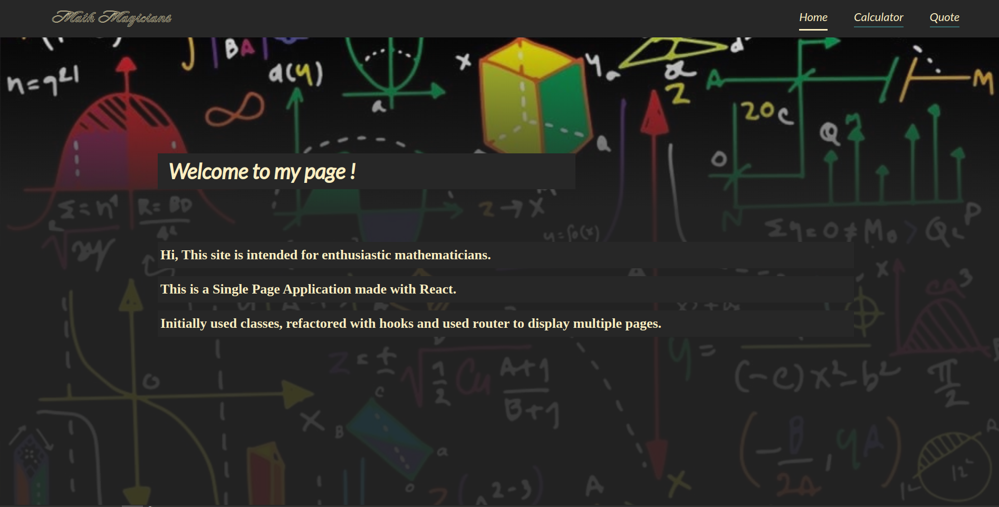

# Math Magicians

## Live preview 
  # Netlify [link](https://calculator-dejan.netlify.app/)

## Screenshots

## Contents
* [Home](#home)
* [Calculator](#calculator)
* [Quote](#quote)

## General info
This project is Single Page App with 3 sub pages, made with React.
Home, page with Calculator and quote about Mathematic.

## Technologies
Project is created with:
* React
* JSX
* CSS

## Setup
To run this project, install it locally using:
- cd Desktop
- git clone https://github.com/VuDej/Math-Magicians.git
- cd Math Magicians
- npm start 

## Author 1

👤 **Dejan Vujovic**

- Github : [@VuDej](https://github.com/VuDej)
- Twitter: [@DejanVuj](https://twitter.com/DejanVuj)
- LinkedIn : [@Dejan-Vujovic](https://www.linkedin.com/in/dejan-vujovic-5a0672225/)

## 🤝 Contributing

Contributions, issues, and feature requests are welcome!

Feel free to check the [issues page](https://github.com/VuDej/Math-Magicians/issues/2).

## Show your support

Give a ⭐️ if you like this project!

## Acknowledgments

- A special thanks to Microverse.

## 📝 License

This project is [MIT](LICENSE) licensed.

## Contact
Created by [@VuDej](https://github.com/VuDej)
